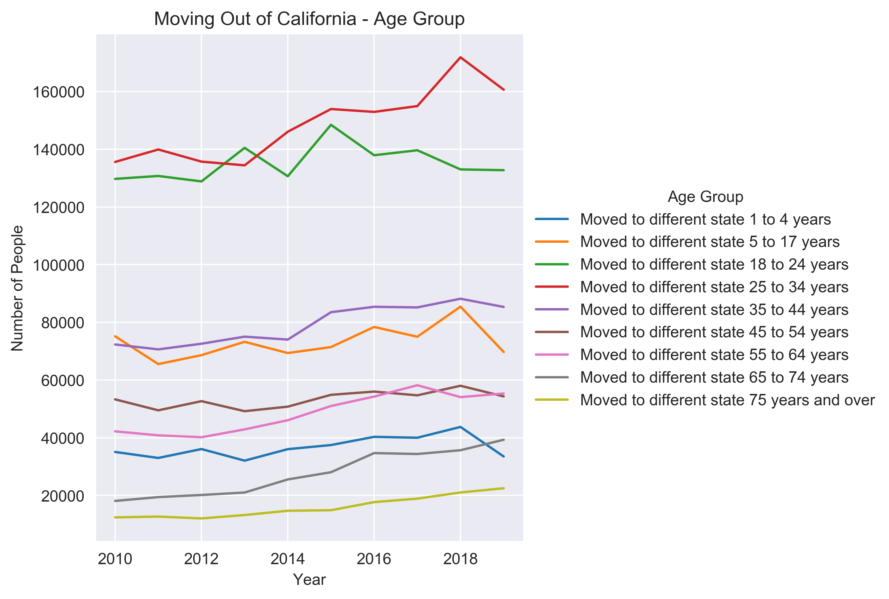
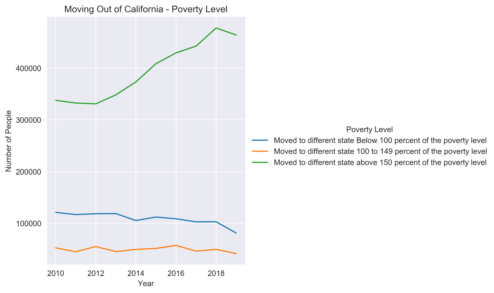

# California: The Golden State Departure

## Summary:
Created an interactive analytical dashboard highlighting factors relating to migration movement out of California using data from the US Census Bureau. Additionally, performed exploratory analysis on data and highlighted several key observations. 
- - -
### Tools: 

- - -
### Deployed Application:
[Click for deployed application](https://itorspwn.github.io/Migration_Pat/)
- - -
### Demo:

- - -
### Exploratory Data Analysis:

- - -
#### Observations over the last 10 years:

* Growing interest in people (55+) moving out of California. Possibility of retirement trend observed.

* In the last two years, the interest for young couples with children moving out of California has slowed down. This may be due to an increase driver to stay in California, such as more attractive opportunities. 

* The interest for people who have achieved a 4-year college degree or higher are growing over the years for moving outside of Califoria.

* There is an increasing number of people who are 150% above the poverty line moving out of California each year. This observation may be tied to the retirement trend observation as older people are more likely to have had more time to build wealth. 

* Change in movement for men and women are at the same rate. 

#### Further Studies:
We noticed that these changes are happening all while poverty and unemployment rates have been dropping in California over the last 10 years. Looking at our economic correlations, such as household income, median house price, and poverty rate, we see no or very low (r = 0-0.2) correlation to people moving out to different states. We hope to identify other variables that may correlate to why people move to different states in order to make a predictive model for number of people moving out of states, such as California. 
